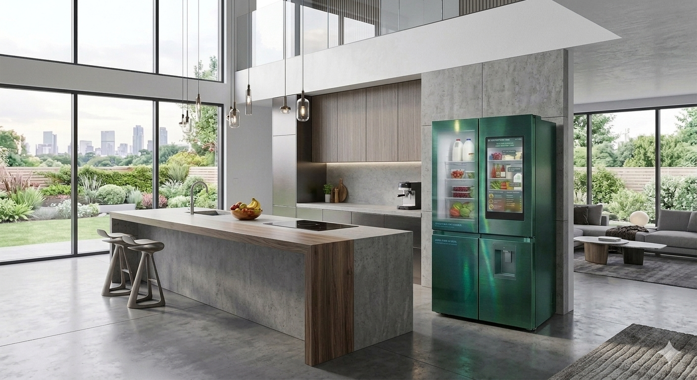
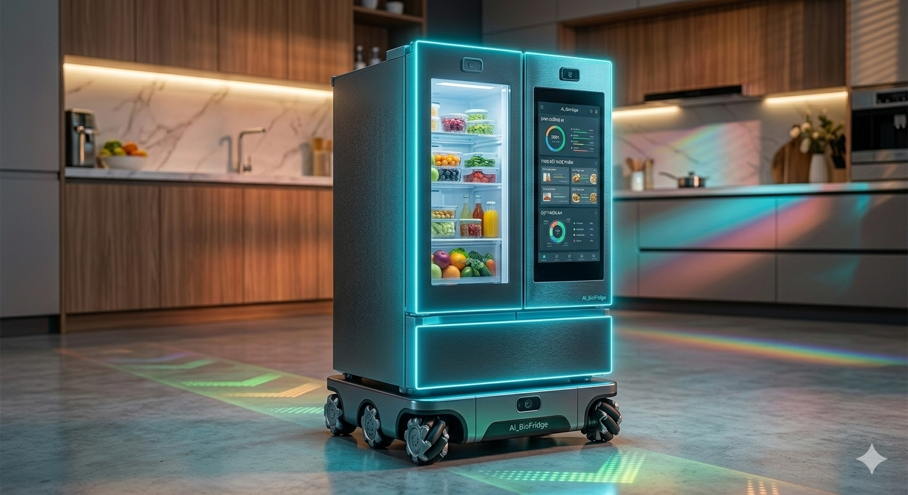

# AI_BioFridge 🍏🩺

**AI_BioFridge** is a next-generation smart nutrition ecosystem powered by **Multimodal AI** and personalized health data. The project bridges the gap between household appliances and proactive family wellness.

---

## 🚀 The Dual-Device Ecosystem

### Part 1: Premium Smart Family Refrigerator (Stationary Hub)



* **Design Language:** High-end multi-door French Door layout featuring seamless, fingerprint-resistant anti-glare matted glass and an integrated, hidden vertical touch display.
* **Computer Vision & OCR:** Embedded high-definition fisheye cameras track inventory and apply automated Optical Character Recognition (OCR) to read expiry dates from food packaging.
* **E-Nose Sub-system:** Integrated volatile organic compound (VOC) and gas sensors (such as Methane, Ethylene, and Ammonia) located at the central air return vent to catch food spoilage *before* structural decay is visible to the eye.
* **Biometric Health Scan:** Operates contact-free heart and respiratory rate checkups using remote Photoplethysmography (**rPPG**) over the door's built-in facial camera while the user stands in front of the device.

### Part 2: Autonomous Mobile Cooling Vehicle (Mini Companion)



* **Design Language:** Compact, low-profile, agile mini-fridge (20L–30L capacity) built on an automated guided vehicle (AGV) chassis to maneuver effortlessly through tight home corridors, under coffee tables, and around furniture.
* **Infinite Power Deployment:** Powered via an ultra-durable, heavy-duty 7-meter power cable managed by an automated motorized cable-retrieval reel. This ensures continuous deep-cooling refrigeration compressor performance without battery degradation, fires, or clutter.
* **Intelligent Navigation:** Employs a 360-degree LiDAR unit and four corner ultrasonic sensors for active room mapping and collision avoidance around pets and footsteps.
* **Proactive Room Service:** Deploys automatically from the kitchen directly to the user's sofa or bedside when the ecosystem’s AI flags high stress, fatigue, or dehydration patterns.

---

## 📁 Project Structure
```text
AI_BioFridge/
├── 📁 01_Documents/         # Concept papers, market analyses, and system logic
│   └── concept_note.md      # Detailed system requirements document
├── 📁 02_Design_Hardware/   # Schematics, sensor placements, and frame assets
│   └── hardware_architecture.txt  # Blueprint specs for both Hub and Vehicle
├── 📁 03_AI_Models/         # Core AI algorithms (rPPG, E-Nose, Vision Processing)
│   └── rppg_monitor.py      # Facial rPPG color channel isolation tool
├── 📁 04_Software_App/      # User interface dashboards and control loops
│   └── mock_ui.py           # Simulated main system control interface
├── .gitignore               # System configuration file for excluded git files
├── big_Fridge.png           # Visual asset for the Stationary Hub Refrigerator
├── mini_Fridge.png          # Visual asset for the Autonomous Mobile Vehicle
├── requirements.txt         # Required Python software libraries
└── README.md                # Main repository documentation
```

---

## 🛠️ Quick Start
1. Clone this repository:
   ```bash
   git clone https://github.com
   cd AI_BioFridge
   ```
2. Install standard dependencies:
   ```bash
   pip install -r requirements.txt
   ```
3. Run the facial vitals scanning module:
   ```bash
   python 03_AI_Models/rppg_monitor.py
   ```
